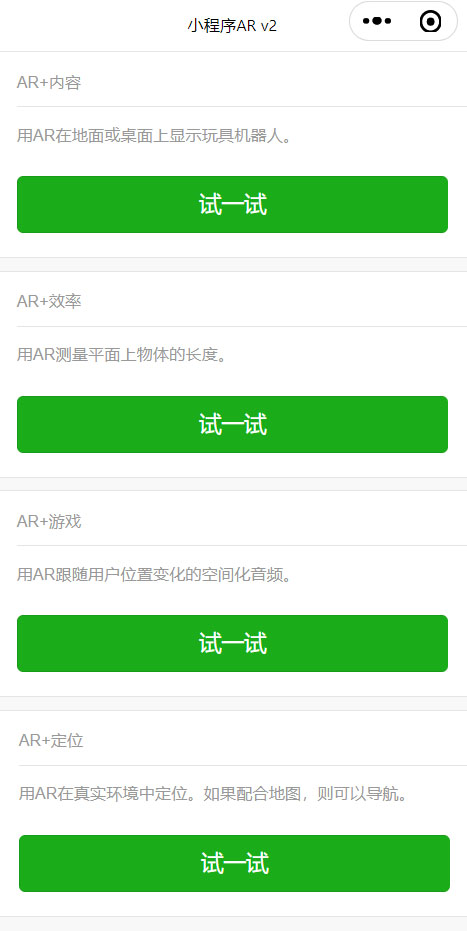
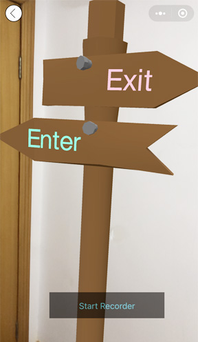

## 更新日志

| 日期　　　| 内容 |
| -- | -- |
| 2022-04-17 | 新增：1、AR玩具机器人固定在平面上 2、AR测量尺子 3、AR空间化音频 4、AR玩具机器人固定在空间中 |


## 介绍

使用微信小程序视觉算法的V2版运行AR，V2版只支持iOS。V2版相比于V1版，有5个主要变化：1、底层平台不同 2、世界坐标系的单位距离不同 3、世界坐标系的原点位置不同 4、增加运动跟踪，即SLAM的定位功能 5、增加垂直平面的识别

|　　　| V1版　　　| V2版 |
| --| -- | -- |
| 底层接口| 视觉算法 | 猜测是ARKit |
| 单位距离| 分米 | 米 |
| 原点位置| 平面中心点 | 相机开始位置 |
| 运动跟踪 | 不支持，视线不能离开地面 | 支持，可以四处观看，比如仰视 |
| 平面跟踪 | 同一时间只能跟踪一个水平面 | 跟踪多个水平面、垂直面 |

本项目包含以下示例：

AR+内容：在平面上显示玩具机器人。

AR+效率：测量平面上物体的长度。

AR+游戏：跟随用户位置变化的空间化音频。

AR+定位：使用运动跟踪显示路标。

## 引用

视觉算法的V2版

https://developers.weixin.qq.com/miniprogram/dev/api/ai/visionkit/wx.createVKSession.html

首页



## AR+内容

1、世界坐标系原点的变化

v1版支持Android和iOS，以识别成功的平面中心点，为世界坐标系原点。

v2版只支持iOS，以手机相机的开始位置，为世界坐标系原点。

2、配置参数的变化

V1版的配置
```javascript
    // 创建AR会话
    session = wx.createVKSession({
        track: {
            plane: { mode: 1 },
        }
    })
```


V2版的配置增加version参数，mode参数增加“垂直平面”的识别。
```javascript
    // 创建AR会话
    session = wx.createVKSession({
        track: {
            // mode参数
            // 1表示检测水平平面
            // 2表示检测垂直平面
            // 3表示检测水平和垂直平面
            plane: { mode: 1 },
        },
        // 新增version参数
        version: 'v2',
    })
```

3、更新3D模型姿态的变化

V1版需要session.hitTest()寻找一个平面，3D模型跟随平面的姿态。
```javascript
// 创建AR的坐标系
function initWorldTrack(model) {
    // 必须 hitTest 才会创建空间坐标系
    const calPosition = function () {
        const hitTestRes = session.hitTest(0.5, 0.5)
        if (hitTestRes && hitTestRes.length) {
            // 代码省略
        } else {
            // 如果创建不成功，则1秒后重试。
            setTimeout(calPosition, 1000)
        }
    }
    calPosition()
}
```
V2版可选择地监听addAnchors、updateAnchors、removeAnchors等事件，3D模型跟随平面的姿态。
```javascript
// 创建AR的坐标系
function initWorldTrack(model) {
    // 代码省略

    wx.showLoading({
        title: '探索平面...',
    });

    session.on('addAnchors', anchors => {
        // 发现新的平面，隐藏提示窗。
        wx.hideLoading();
        // 代码省略
    })

    session.on('updateAnchors', anchors => {
        // 因为场景中camera的姿态在自动更新，所以不需要手动更新模型model的姿态。
    })

    session.on('removeAnchors', anchors => {
        // 当平面跟踪丢失时
    })
}
```

## AR+效率

V1版的世界坐标系的单位距离是分米。
```javascript
    // 测量的距离
    var distance = currentPoint.distanceTo(lastPoint)
    distance = (distance / 10).toFixed(2)
    callback(distance)
```

V2版的世界坐标系的单位距离是米。
```javascript
    // 测量的距离
    var distance = currentPoint.distanceTo(lastPoint)
    distance = Math.round(distance * 100)
    callback(distance)
```

V1版的模型大小
```javascript
function addPoint(color) {
    const geometry = new THREE.CylinderGeometry(0.03, 0.03, 0.03, 32);
}
```

V2版的模型大小，缩小1/10。
```javascript
function addPoint(color) {
    const geometry = new THREE.CylinderGeometry(0.003, 0.003, 0.003, 32);
}
```

## AR+游戏

V1版，当手机摄像头没有朝向地面时，3D模型会漂移、忽大忽小、无法停留在开始的位置。原因是AR以地面为跟踪目标，如果地面从手机画面中消失，V1版AR就无法正常运行。

V2版，没有V1版的这些问题。原因是AR以房间环境为跟踪目标，无论手机摄像头朝向任何方向，手机画面都是在房间环境内。如果遮住手机摄像头，V2版AR也无法正常运行。

## AR+定位

V2版有运动跟踪功能，即SLAM（同步定位与地图构建）的定位功能。世界坐标系中的相机位置表示用户手机在真实环境中的位置，用户可以按照地图和自身位置，到达目的地。另外，可以用AR的方式显示虚拟路线。

该示例显示了一个路标，表示出口和入口的方向。



## AR+AI（已删除）

用AI检测图像中的物体，将名称显示在物体上。这个在V1版项目中是一个试验性的功能。虽然小程序可以同时运行3D、AR、TensorFlow，但会发生内存不足的问题。在V2版项目中，已去掉。

## AI人脸检测（已删除）

根据AI检测的人脸姿态，将虚拟眼镜佩戴在人脸上。这个包含在V1版项目中，因为小程序API没有变化，所以V1版不需要更新，V2版项目没有包含该示例。

## 如何使用

使用微信开发者工具，打开项目源代码，在手机上预览。

## 如果更换3D模型

在源代码中修改常量robotUrl。

文件位置：/package_world_track/pages/camera/camera.js
```javascript
  // 机器人模型
  const robotUrl = 'https://m.sanyue.red/demo/gltf/robot.glb';
```

## V1版和V2版的优缺点

V2版的优点：3D模型姿态的稳定性极佳，比V1版好，可以任意角度观看3D模型。

V2版的缺点：寻找平面的时间比V1版长，建议做好提示。运动跟踪功能在交通工具上不能运行。

V1版的优点：支持Android和iOS，而V2版只支持iOS。

V1版的缺点：手机摄像头方向朝上、走近3D模型等情况，3D模型姿态会不稳定。


